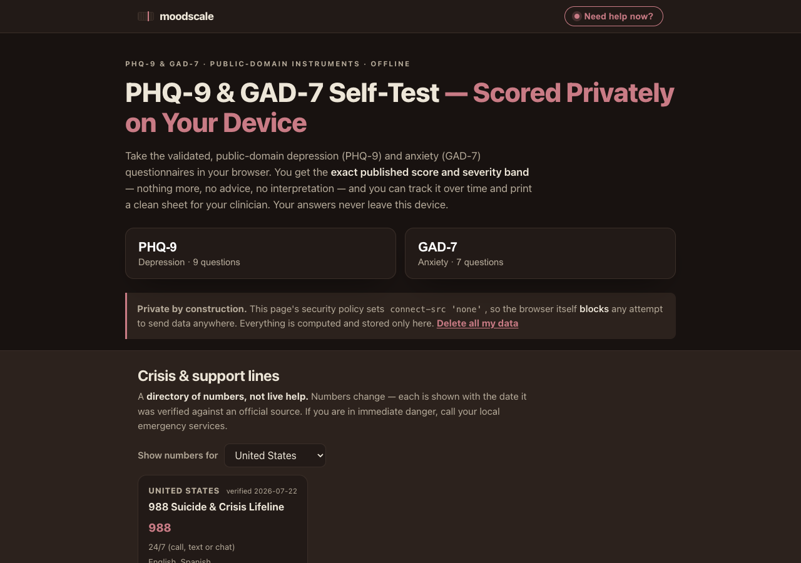

# moodscale

**PHQ-9 & GAD-7 self-test — scored privately on your device.** Take the validated,
public-domain depression (PHQ-9) and anxiety (GAD-7) questionnaires in your browser,
get the *exact published score and severity band* — nothing more, no advice, no
interpretation — track it over time, and print a clean sheet for your clinician. Your
answers never leave this device. 100% client-side, zero dependencies, works fully offline.

## Why

Search "PHQ-9 test online" or "GAD-7 self test" and most results are telehealth
lead-generation pages that log your answers behind the scenes. If you are tracking scores
between therapy sessions, you want the opposite: the plain instrument, the published
score, and a record that stays yours.

moodscale is that. It reproduces the two instruments verbatim, computes the total as pure
addition on your device, shows the **published severity band and nothing else**, and keeps
a private history you can chart and print. Because the page's own security policy forbids
all network access, "private" is enforced by the browser, not merely promised.

## Features

- **PHQ-9 (depression) and GAD-7 (anxiety)** with verbatim published wording and the four
  published 0–3 response options. Every item is required — no answer is ever assumed.
- **Exact published score and band** — e.g. a PHQ-9 of 13 is shown as *Moderate*, cited to
  Kroenke, Spitzer & Williams (2001). No advice, no interpretation, by design.
- **The graduated-band readout** — a laboratory-ruler severity scale with one oxblood
  marker at your score, echoed as the trend chart's shaded backdrop.
- **Crisis handling** — any answer of 1 or more on the PHQ-9 self-harm item surfaces a calm,
  unskippable helpline panel *above* the score; a "Need help now?" link is always one tap away.
- **Verified helpline directory** — a hand-checked list of crisis lines (India-first:
  Tele-MANAS 14416, KIRAN 1800-599-0019, plus US/UK/AU/CA and more), each shown with the
  date it was verified against an official source. It is a directory of numbers, not live help.
- **Private history & trend** — every check-in is saved locally with an ISO timestamp; a
  per-scale trend chart shades the background using the same published cutoffs as the scorer.
- **Clinician handoff** — a print-to-PDF sheet with the latest per-item responses (the
  self-harm item clearly visible) and an RFC-4180 CSV export of your full history.

## Quickstart

Just open `index.html` in any modern browser — no build step, no server, no install.

- **Local:** double-click `index.html`, or run a static server in the folder.
- **Hosted:** **[Open moodscale live](https://sreenivas-sadhu-prabhakara.github.io/moodscale/)**

Your history is saved in your browser's local storage, so it persists between visits.

## Privacy

- A strict Content-Security-Policy sets `connect-src 'none'`: the app **cannot** make any
  network request even if it tried. There is no analytics, no CDN, no external font.
- All scoring runs in your browser. Your answers, scores and history are stored only on
  your own device and are never transmitted.
- A one-tap **Delete all my data** button clears everything. Export the CSV first if you
  want a backup — clearing site data erases the local history.

## The instruments (provenance)

Both questionnaires are **public domain** and are reproduced verbatim; see
[`sources/CITATIONS.md`](./sources/CITATIONS.md) for exact wording sources and licensing text.

- **PHQ-9** — developed by Drs. Robert L. Spitzer, Janet B.W. Williams, Kurt Kroenke and
  colleagues (educational grant from Pfizer Inc.). The instrument states: *"No permission
  required to reproduce, translate, display or distribute."* Severity bands (0–4 minimal,
  5–9 mild, 10–14 moderate, 15–19 moderately severe, 20–27 severe) are from Kroenke, Spitzer
  & Williams, *J Gen Intern Med* 2001;16:606–613.
- **GAD-7** — Spitzer, Kroenke, Williams & Löwe, *Arch Intern Med* 2006;166:1092–1097.
  *"May be printed without permission. Available in the public domain."* Severity bands
  (0–4 minimal, 5–9 mild, 10–14 moderate, 15–21 severe).

Instruments and helplines were **verified on 2026-07-22**.

## Honest limits

- A **screening tool, not a diagnosis** — only a qualified clinician can diagnose depression
  or anxiety. moodscale shows only the published band label and adds no interpretation.
- **Not a crisis service** — the help panel is a static directory of numbers verified on the
  stated date; numbers change. If you are in immediate danger, call your local emergency services.
- **English adult instruments only** — not the adolescent PHQ-A, and no translated versions
  (published translations carry their own validation and distribution terms). No C-SSRS
  (it is licensed, not public domain).
- **Trend lines are raw scores over time**, which carry measurement error; they are not a
  measure of treatment response.
- Your history lives only in this browser's local storage; the PDF/CSV export is the only backup.

## Disclaimer

moodscale reproduces the public-domain PHQ-9 and GAD-7 screening questionnaires and reports
only their published scores and severity bands, for informational and self-tracking purposes
only. It is **not** medical advice, diagnosis, or treatment, and is not a substitute for
professional care. A screening score cannot diagnose any condition; only a qualified
clinician can. This is not a crisis service. Instruments and helpline numbers were verified
on 2026-07-22 and may change. This software is provided under the MIT License, "as is",
without warranty of any kind; the authors accept no liability for any loss, injury, or damage
arising from its use.

## License

[MIT](./LICENSE) © 2026 Sreenivas Sadhu Prabhakara
